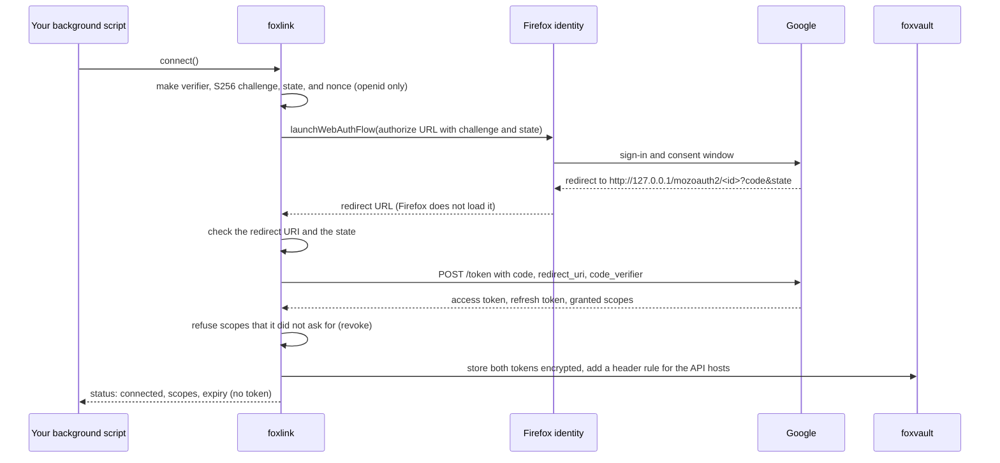
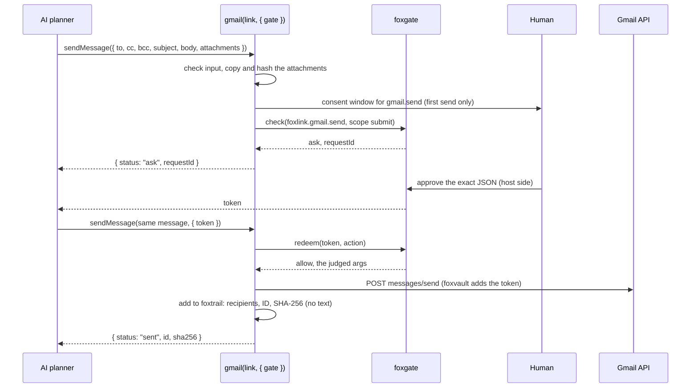
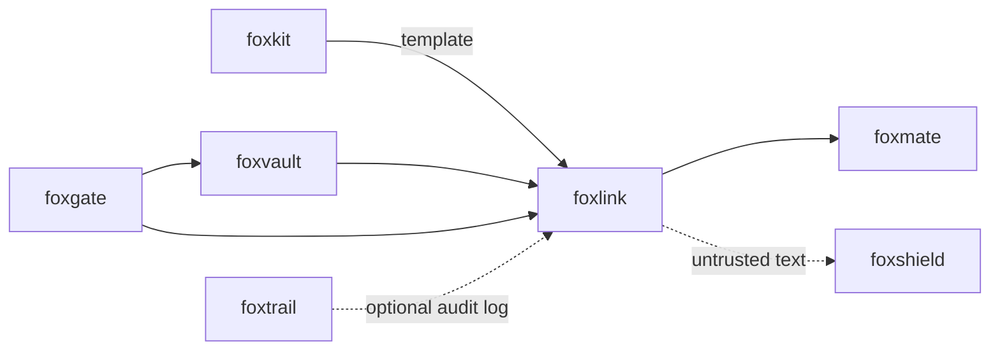

# foxlink

<p align="center">Connect Gmail and Google Calendar to a Firefox extension with OAuth.</p>

<p align="center">
  <a href="https://github.com/pooriaarab/foxlink/actions"></a>
  <a href="LICENSE"></a>
</p>

foxlink runs the OAuth 2.0 authorization code flow with PKCE through
`identity.launchWebAuthFlow`. It works with any provider config, and it has
a Google preset for Gmail and Calendar. The tokens go into
[foxvault](https://github.com/pooriaarab/foxvault). With the `inject`
transport, foxvault adds the access token to each API request in Firefox.
Then your extension code, the page, and the AI model never get the token. Sending an email or adding an event
waits for a [foxgate](https://github.com/pooriaarab/foxgate) approval of
the exact action. Email and event text comes back marked as untrusted.

You bring your own OAuth client ID. foxlink ships none.

## Install

```bash
npm i foxlink-oauth
```

The npm package is `foxlink-oauth`: npm refuses the plain name `foxlink` as too similar to an existing package (oxlint and comlink).


foxlink needs `foxvault` and `foxgate`. npm installs them with it.

## Example

This code runs in the background script of a Firefox extension. The
extension needs the permissions `identity`, `storage`, `webRequest`, and
`webRequestBlocking`, and host permissions for the Google hosts. The
extension in `extension/` makes the same calls.

```js
import { storageAreaStore } from "foxgate";
import { attachHeaderInjection, createVault, indexedDbKeyStore } from "foxvault";
import { calendar, createLink, gmail, googleProvider } from "foxlink-oauth";

const store = storageAreaStore(browser.storage.local);
const vault = createVault({ store, keyStore: indexedDbKeyStore() });
attachHeaderInjection(vault, browser); // at the top level of the event page

const provider = googleProvider({ clientId: "YOUR_CLIENT_ID.apps.googleusercontent.com" });
const link = createLink({ provider, vault, store, identity: browser.identity, transport: "inject" });

// Call this from a message handler, for example when the user selects a button.
async function today() {
  if ((await vault.status()) === "new") await vault.initialize();
  if (!(await link.status()).connected) await link.connect(); // opens the Google sign-in window
  const { events } = await calendar(link).listEvents({ max: 3 });
  const { messages } = await gmail(link).listMessages({ max: 5 });
  return { events: events.map((e) => e.summary), subjects: messages.map((m) => m.subject) };
}
```

The HTML to text function also runs in Node:

```js
import { htmlToText } from "foxlink-oauth";

console.log(htmlToText('<p>Hi &amp; welcome</p><script>steal()</script>'));
// Hi & welcome
```

## Use cases

| Who | What they build | How foxlink helps |
|---|---|---|
| A browser agent author (for example foxmate) | An agent that reads the user's inbox and calendar and answers email | The agent gets message text marked `untrusted`, and never a token. A send waits for the user to approve the exact recipients, subject, body, and attachments. One approval sends one message. |
| An email assistant author | A helper that writes replies for the user to check and send from Gmail | `gmail(link, { draftOnly: true })` saves drafts with no approval and cannot send. |
| A scheduling assistant author | An agent that puts meetings on the user's calendar | `createEvent` shows the time zone and attendees for approval, and sends no invites unless the approval says `sendUpdates: "all"`. `patchEvent` moves only events that the user organizes. |
| An auditor of an agent | A record of what the agent sent, with no copy of the mail | Pass a foxtrail log as `trail`. Each send adds the recipients, the Gmail ID, and the SHA-256 of the raw message. |
| An extension author | A "what is next today" popup or new tab page | `listEvents({ max: 3 })` with the read-only Calendar scope, and refresh on expiry with no code of your own. |
| A privacy tool author | An inbox cleaner that runs on the user's device only | The mail goes from Google to the extension and nowhere else. `htmlToText` drops scripts and tracking pixels, so opening a message loads nothing. |
| An author of another OAuth integration | A link to GitHub, Notion, or any provider that issues codes with PKCE | `defineProvider` takes the endpoints, scopes, and API hosts. `connect`, `fetch`, refresh, and `disconnect` work the same. |
| An MCP server or agent framework author | An email or calendar tool for a model | `gmail` and `calendar` return small typed records. `toPromptText` fences each record so that its text cannot close the fence. |
| A security reviewer | A check that an extension asks only for what it needs | The Google preset asks for read scopes. It asks for a write scope only at the first write that needs it, and only when `allowedScopes` holds it. `connect` refuses scopes that the server adds. |

## How it works



1. `connect` makes a 43-character PKCE verifier and sends its SHA-256
   challenge. It sends a random `state`, and a `nonce` when the scopes hold
   `openid`.
2. The redirect URL must have the same origin and path as the redirect URI,
   and the same `state`. Else foxlink reads no code from it.
3. When the server grants a scope that foxlink did not ask for, foxlink
   revokes the token and stores nothing.
4. The access token and the refresh token are foxvault secrets. The store
   holds only the scopes, the issue and expiry times, and whether a refresh
   token exists.
5. `link.fetch` sends requests to the API hosts only. It refreshes the
   access token 60 seconds before expiry (or at half its life, when that is
   sooner) and one time after a 401. Calls at the same time share one
   refresh request. A refresh that a `connect` or a `disconnect` overtook
   throws its token away.
6. When Google refuses the refresh token (`invalid_grant`), foxlink forgets
   the tokens and throws `reconnect`.



A changed message gets `action-changed`, also for one changed attachment
byte. A used token gets `token-used`. Every failure mode has a test: see
[docs/failure-modes.md](docs/failure-modes.md).

## API

This package is a library only. It has no CLI and no MCP server. The tokens
must stay in one extension, behind foxvault. A CLI or an MCP server would
have to hold the tokens in another process.

### Providers

| Export | What it does |
|---|---|
| `googleProvider({ clientId, clientSecret?, scopes?, allowedScopes?, endpoints?, allowHttp? })` | The Google preset. Default scopes: `gmail.readonly` and `calendar.readonly`. `allowedScopes` is the most that `connect` may ask for. It uses the loopback redirect and asks for offline access. |
| `defineProvider(config)` | Any provider. `config` has `id`, `clientId`, `authorizeUrl`, `tokenUrl`, `revokeUrl?`, `scopes`, `allowedScopes?`, `apiHosts`, `authParams?`, `redirect?` (`"extension"` or `"loopback"`), `issuers?`, and `allowHttp?`. |
| `GOOGLE_SCOPES` | `gmailRead`, `gmailSend`, `gmailCompose`, `calendarRead`, and `calendarEvents`. |
| `GOOGLE_ENDPOINTS` | The Google authorize, token, revoke, Gmail, and Calendar URLs. |
| `loopbackRedirectUrl(url)` | `http://127.0.0.1/mozoauth2/<subdomain>` from the value of `identity.getRedirectURL()`. |

`allowHttp` is for test servers only. Without it, every endpoint must use
`https:`.

#### Scopes

| Scope | Used by | When foxlink asks for it |
|---|---|---|
| `gmail.readonly` | `listMessages`, `getMessage` | At `connect`, by default. |
| `calendar.readonly` | `listEvents` | At `connect`, by default. |
| `gmail.send` | `sendMessage` | At the first send, when `allowedScopes` holds it. |
| `gmail.compose` | `createDraft` | At the first draft, when `allowedScopes` holds it. |
| `calendar.events` | `createEvent`, `patchEvent` | At the first event write, when `allowedScopes` holds it. |

A write scope request is a new `connect`, so the user sees Google consent again.

### `createLink(options)`

| Option | Default | What it does |
|---|---|---|
| `provider` | required | From `googleProvider` or `defineProvider`. |
| `vault` | required | A foxvault vault. |
| `store` | `memoryStore()` | Where the token record lives. In Firefox, `storageAreaStore(browser.storage.local)`. |
| `identity` | none | `browser.identity`. foxlink uses it for the redirect URI and the sign-in window. |
| `redirectUri` | from `identity` | Set it to use another redirect URI. |
| `launch` | `identity.launchWebAuthFlow` | Opens the authorize URL and returns the redirect URL. |
| `transport` | `"use"` | `"inject"`: foxvault adds the header in Firefox, with `attachHeaderInjection`. `"use"`: foxlink adds it in your host code, for example in Node. |
| `fetch` | global `fetch` | The fetch function. |
| `now` | `Date.now` | The clock. |
| `skewMs` | 60,000 | Refresh this long before the access token expires. foxlink uses half of the token life when that is shorter. |

| Method | What it does |
|---|---|
| `connect({ scopes?, interactive? })` | Runs the sign-in. Returns the status. |
| `status()` | `{ connected, scopes, expiresAt?, refreshable? }`. It holds no token. |
| `hasScope(scope)` | True when the user granted the scope. |
| `fetch(url, init?)` | `fetch` for the API hosts, with the access token. |
| `disconnect()` | Revokes the grant and forgets the tokens. Returns `{ revoked }`. It forgets them also when the revoke fails. |
| `redirectUri()` | The redirect URI to register with the provider. |

### Gmail and Calendar

| Method | What it does |
|---|---|
| `gmail(link, { gate? }).listMessages({ query?, max?, pageToken? })` | The newest messages with From, To, Subject, Date, and the snippet. `max` is 1 to 50 (default 10). Returns `{ messages, nextPageToken? }`. |
| `gmail(link).getMessage(id)` | One message with `text`: the `text/plain` part, or the HTML part as plain text. |
| `gmail(link, { gate, trail?, draftOnly?, privateMode? })` | `trail` is a foxtrail `Log`. A trail write that fails gives `logged: false`. `privateMode` returns true while the run is in private-data mode: then each approval holds `privateData: true`. |
| `gmail(link, { gate }).sendMessage({ to, cc?, bcc?, subject, body, attachments? }, { token? })` | A plain text email, after a foxgate approval. `attachments` is a list of `{ filename, mimeType, data }`, with `data` a `Uint8Array`. A subject with non-ASCII characters or `=?` goes out as RFC 2047 encoded words, so the recipient sees the approved text. Returns `{ status: "sent", id, sha256 }`, `{ status: "ask", requestId }`, or `{ status: "refused", reason }`. |
| `gmail(link).createDraft(message, { token? })` | Saves the same message as a Gmail draft, with no approval. In private-data mode it asks foxgate first. Returns `{ status: "drafted", id, sha256 }`. |
| `calendar(link).listEvents({ timeMin?, timeMax?, max? })` | The next events from `timeMin` (default: now), by start time. Returns `{ events }`. |
| `calendar(link, { gate }).createEvent({ summary, start, end, timeZone?, attendees?, sendUpdates?, description?, location? }, { token? })` | Adds an event, after a foxgate approval. `timeZone` defaults to the browser time zone, and `sendUpdates` to `none`, so nobody gets an invite. The approval shows every field with its default. Returns `created`, `ask`, or `refused`. |
| `calendar(link, { gate }).patchEvent(id, changes, { token? })` | Changes the given fields of an event that the user organizes, after an approval. `start`, `end`, and `timeZone` go together. The approval also holds the current title, start, and end. Returns `updated`, `ask`, or `refused`. |
| `FOXLINK_TOOLS` | `foxlink.gmail.send`, `foxlink.gmail.draft`, `foxlink.calendar.create`, and `foxlink.calendar.update`, all with scope `submit`. Pass it to `createFoxgate({ tools })`, and add a `submit` grant for the API hosts. |

Refused reasons: `bad-input`, `missing-scope`, `no-gate`, `approval-required`,
`draft-only`, `not-own-event`, a `connect` error code such as `access-denied`, and every foxgate
deny reason, for example `action-changed`, `token-used`, or `rejected`.

### Text

| Export | What it does |
|---|---|
| `htmlToText(html)` | Plain text with no DOM and no network, in one pass. Scripts, styles, comments, and image URLs go away. Only a real close tag ends a script or style block. |
| `toPromptText(record)` | The record inside `<untrusted source="…" id="…">` tags. Its text cannot close the tag. |
| `decodeEntities(text)` | Decodes HTML entities one time. |
| `messageText(payload)` | The text of a Gmail message payload. |

Every message and event has `trust: "untrusted"` and a `source`. A tool such
as foxshield can then check the text before a model reads it.

### Errors

`FoxlinkError` has a `code`: `bad-config`, `bad-scope`, `busy`,
`authorize-failed`, `redirect-mismatch`, `state-mismatch`, `access-denied`,
`token-error`, `scope-creep`, `id-token`, `not-connected`, `reconnect`,
`unauthorized`, `bad-host`, `http-error`, `missing-scope`, or `bad-input`. It
can have `status` (HTTP) and `oauthError` (the server error code, cut to
`a-z 0-9 _`). No message holds a token, a code, or server text. Vault errors,
for example `locked`, come through as foxvault `VaultError`.

## The extension

`extension/` is the foxlink add-on for Firefox 153+. Type your OAuth client
ID in Settings. Then use "Connect Google", "Show my next 3 events", "Show 5
latest email subjects", and "Read the latest email". The first send asks
Google for the send scope. Then the popup shows To, Cc, Bcc, the subject,
the body, and each attachment, and it sends only after you approve. "Add an
event" works the same way, and sends invites only when you tick the box.

```bash
pnpm install
pnpm build:ext   # builds dist-ext/; load it from about:debugging
pnpm e2e         # builds with --e2e and runs it in Firefox against the local fake Google
```

Install from AMO: [addons.mozilla.org/firefox/addon/foxlink](https://addons.mozilla.org/firefox/addon/foxlink/)
(pending AMO review; the link works after approval).

### Use your own Google client ID

We have not tested foxlink with a real Google account. We tested it against
the fake Google server in `e2e/fake-google.mjs`, which copies the Google
endpoints and REST shapes. These are the steps to try the real Google:

1. In the [Google Cloud console](https://console.cloud.google.com/), create a
   project or select one.
2. In **APIs & Services > Library**, enable the **Gmail API** and the
   **Google Calendar API**.
3. Open **Google Auth Platform** (the OAuth consent screen). Set the
   audience to **External**. Add your own Google account as a test user.
4. In **Data Access**, add the scopes `gmail.readonly` and
   `calendar.readonly`. Add `gmail.send` only if you want to send, and
   `gmail.compose` only if you want drafts, and `calendar.events` only if
   you want to add events.
5. In **Clients**, create an OAuth client with the application type
   **Desktop app**. Google accepts loopback redirect URIs for this type.
   Copy the client ID and the client secret.
6. In the foxlink Settings, paste the client ID and the client secret.
   Select **Save**, then **Connect Google**.

If Google refuses the redirect URI, make a **Web application** client
instead. Add the redirect URI that the foxlink Settings show under
**Authorized redirect URIs**. Google treats the client secret of an
installed app as not secret. foxlink sends it to the token endpoint only.

While the app is in the **Testing** state, Google makes refresh tokens that
expire in 7 days. Then foxlink asks you to connect again. `gmail.readonly`
is a restricted scope. A public app with it needs a Google review.

## Firefox APIs used

| API | MDN | Why |
|---|---|---|
| `identity.launchWebAuthFlow` (permission `identity`) | [launchWebAuthFlow](https://developer.mozilla.org/en-US/docs/Mozilla/Add-ons/WebExtensions/API/identity/launchWebAuthFlow) | Open the sign-in window and get the redirect URL with the code. |
| `identity.getRedirectURL` | [getRedirectURL](https://developer.mozilla.org/en-US/docs/Mozilla/Add-ons/WebExtensions/API/identity/getRedirectURL) | The stable redirect URL from the add-on ID. The Google preset turns it into the loopback form. |
| Loopback redirect `http://127.0.0.1/mozoauth2/<subdomain>` (Firefox 86+) | [identity](https://developer.mozilla.org/en-US/docs/Mozilla/Add-ons/WebExtensions/API/identity) | Google refuses the `extensions.allizom.org` domain, because nobody can verify it. |
| Web Crypto `subtle.digest` and `crypto.getRandomValues` | [digest](https://developer.mozilla.org/en-US/docs/Web/API/SubtleCrypto/digest) | The PKCE verifier and challenge, the state, and the nonce. |
| `fetch` | [fetch](https://developer.mozilla.org/en-US/docs/Web/API/Window/fetch) | The token, revoke, Gmail, and Calendar requests. |
| `webRequest.onBeforeSendHeaders` with `blocking`, through foxvault | [onBeforeSendHeaders](https://developer.mozilla.org/en-US/docs/Mozilla/Add-ons/WebExtensions/API/webRequest/onBeforeSendHeaders) | foxvault adds the access token to requests from the extension to the API hosts. |
| IndexedDB, through foxvault | [IndexedDB API](https://developer.mozilla.org/en-US/docs/Web/API/IndexedDB_API) | The non-extractable vault key. |
| `storage.local` | [storage.local](https://developer.mozilla.org/en-US/docs/Mozilla/Add-ons/WebExtensions/API/storage/local) | Encrypted tokens, the token record, foxgate state, and the popup settings. |
| `runtime.sendMessage`, `runtime.onMessage` | [runtime](https://developer.mozilla.org/en-US/docs/Mozilla/Add-ons/WebExtensions/API/runtime) | The popup talks to the background page. Extension only. |

## Limits

- We have not tested the real Google path. The tests use a fake Google
  server. We do not know yet if Google accepts the redirect URI
  `http://127.0.0.1/mozoauth2/<id>` with no port for a Desktop app client.
- foxlink does not check the ID token signature. It checks `nonce`, `aud`,
  and `iss` of an ID token that came straight from the token endpoint over
  TLS, as OpenID Connect Core 3.1.3.7 allows.
- `htmlToText` does not remove hidden text, for example text with
  `display: none`. Check the text with a tool such as foxshield.
- `getMessage` decodes every body as UTF-8. A body in another character
  set can show wrong characters.
- `connect` compares the granted scopes with the asked scopes as text. Use
  full scope URLs. A short name such as `email` comes back from Google as
  `https://www.googleapis.com/auth/userinfo.email`, and foxlink refuses it
  as `scope-creep`.
- The Google preset sends the access token to every request from the
  extension to `gmail.googleapis.com` and `www.googleapis.com`. The token
  scopes limit what those requests can do.
- `connect` does not revoke the tokens of an earlier connect. It replaces
  them in the vault.
- `sendMessage` takes bare addresses only, for example `ana@example.com`,
  not `Ana <ana@example.com>`.
- `sendMessage` sends a plain text body, with no HTML and no reply
  threading. The most it takes: 20 recipients, a body of 40,000 characters
  (the approval must fit in 64 KB), and 10 attachments of 3 MB together.
- `gmail.compose` lets the token send too. foxlink sends only after an
  approval, but other code with the token can send. The host must pass
  `privateMode`: foxlink does not know the run mode by itself.
- `listMessages` gets at most 50 messages for each call. It does not page
  through the whole mailbox by itself.
- `listEvents`, `createEvent`, and `patchEvent` use one calendar (`primary`
  by default). Events have no recurrence, reminders, or meeting links.
  foxlink cannot delete or cancel an event.
- One link object for each provider, in one background page. Two link
  objects on the same store do not share a refresh, so they can send two
  refresh requests at the same time.
- In passphrase mode, a locked vault stops every call with `locked`.
- Only the e2e build (`node scripts/build-ext.mjs --e2e`) has the host
  permission `http://*.localhost/*` and the local server port, for the fake
  Google. The release build that AMO signs has neither.

## Part of the fox primitives



foxlink depends on foxvault for the tokens and on foxgate for approvals.
It can write each send to a foxtrail log, but it does not install foxtrail.
foxshield does not depend on foxlink. An app can pass foxlink text to
foxshield before a model reads it.

## License

[MIT](LICENSE)
